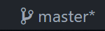

Branches
========

> This is just a brief overview, for a more complete 
explanation, please see [this guide][0] on Git's website.

What
----
A branch is a derivative of some source code that has taken a 
different path (branch) than the original code. These branches 
are stored separate from one another by Git and can be created 
and merged into each other at any point in time. Note that only
one branch can be checked out at a time.

Why
---
Branches allow you to work on multiple different features or 
bugs at the same time without interfering with each other. They 
can then be pushed to the remote tracking server separately and 
pull requests can be made to merge each feature in individually.

When
----
You should create a new branch whenever you're about to start 
working on a feature or bug fix (or anything else), no matter 
how small. Branches are very easy work with and take only a few 
seconds to create and destroy, and the added benefit of 
separation and organization is worth it in the long run.

How
---
### Creating a branch
As with almost all Git features and tools, branching can 
either be accomplished using VS Code's Git integration, or on 
the command line using `git` commands. To create a new branch 
in Code, click on the branch icon next to the name of the 
branch you currently have checked-out in the lower-leftmost 
corner of the screen
.
You can then give your branch a name of 
`yourname/feature-1234` for a feature, or `yourname/bug-1234` 
for a bug. In my case, I would name a feature branch like 
`mswitzer/jwt-auth-1234` and a bug fix branch like this 
`mswitzer/bug-1234`. Naming isn't an exact science, so feel 
free to do what feels right as long as it's uniquely 
identifiable. To branch on the command line, you can use

    #create a branch and immediately check it out
    git checkout -b "branchname"
    
    or

    #create a branch, but leave the current branch checked out
    git branch "branchname"

### Checking out branches
Once you've created a branch, you can commit to that branch as 
many times as you'd like and you can switch branches using the 
same button as before in VS Code, or by using `git checkout 
"branchname"` on the command line. Keep in mind that any 
changes that are uncommitted when switching branches will be 
moved over to the branch you check out.

### Pushing a branch
When you're ready to push your code for the first time, you 
need to tell the upstream server to create that new branch on 
it's end and then you can push any new code to it afterwords 
with a simple `push` command. In VS Code, navigate to the 
source control sidebar and click the ellipsis (...) and then 
the option "Publish Branch". In the command line, execute the following:

    git push -u origin "branchname"

This tells Git to push your branch to the upstream server 
named "origin" (the default), and then to link your local 
branch to the upstream one. All further commits can be pushed 
just by doing a standard `git push` on that branch.

### Deleting a branch
There are two situations when you'd want to delete a branch:
* When you no longer want the changes in an "experimentation" 
branch
* When the branch's changes have been merged into master due 
to a PR being completed.

In both cases, you only need to delete a local branch; the 
server takes care of deleting remote branches after a PR has 
been completed. In VS Code, there is no menu item to delete a 
branch, you must search for the command by first pressing 
`Ctrl + P` and then typing `>Delete Branch`. You can then 
press enter or click the command which will prompt you to 
select a branch to delete. In the command line, you can execute this command:

    git branch -d "branchname"

This will fail if your changes have not been merge into 
another branch, if you still want to delete the branch and 
lose all unmerged changes, change the `-d` to an uppercase 
`-D` to force deletion.

> **Warning! This action is permanent 
and you most likely won't be able to recover any changes that 
have not been merged into another branch. Please delete 
branches with extreme care.**

[0]:https://git-scm.com/book/en/v2/Git-Branching-Branches-in-a-Nutshell